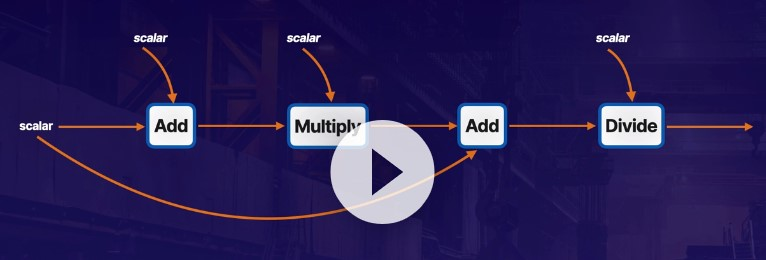

# TensorFlow

Interface for expressing machine learning algorithms 

### Concept
* Build
* Compile
* Train
* Evaluate

### Computational Graph with nodes and edges 

DAG (Directed Acylic Graph) 
* DAG is a data structure i.e. JSON/YML
* Directed : traverse the graph in predefined sequence
* Acylic : No looping . Data doesnt go through same node more than once
* Graph : nodes and edges represent data transformation process

Node in the graph represent operation
Edges represent tensor data

### Keras

* Layers are groups of graph operations that transform data
    * Stateless - simple operation i.e. averages, maximum, data reshaping
    * Stateful - operation with memory , which allows layer to be trained

### Environment
* Direct
* Virtual
* Docker 

### Execution Environments

* CPU - anything with processor
* GPU - dedicated graphics cards
* TPU - tensor processing units

### Gradient Descent
* Populat optimizer for adjusting values to reduce error 
* finding steepest down the hill , fastest reduction 
* when reaches minimum , the loss value no longer decreases
* if learning rate set too high , it ends up bouncing around 
* calculating the derivatives of the model with respect to its features 
* gradient descent based optimizers are an often used method for minimizing loss 

